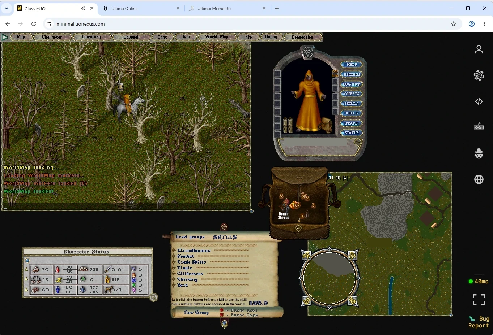
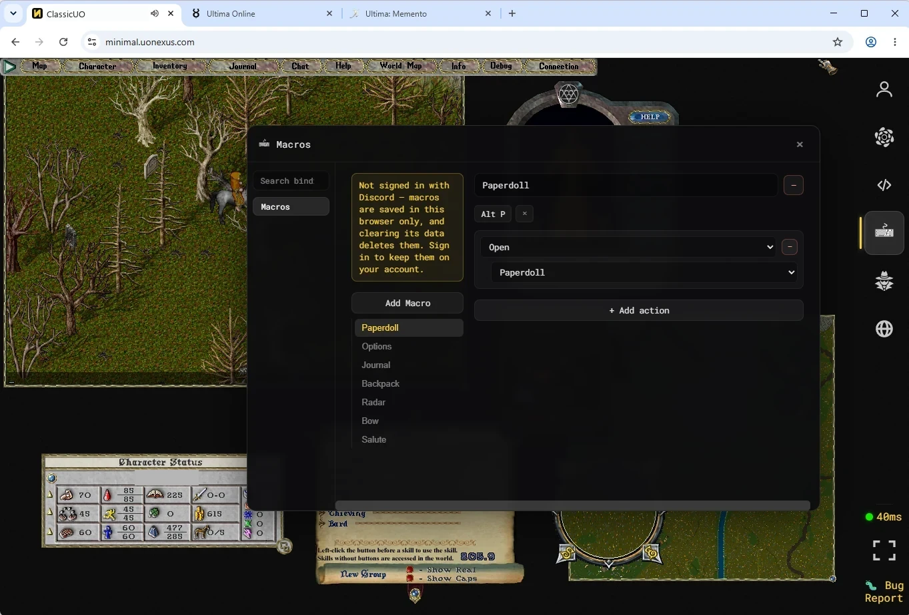
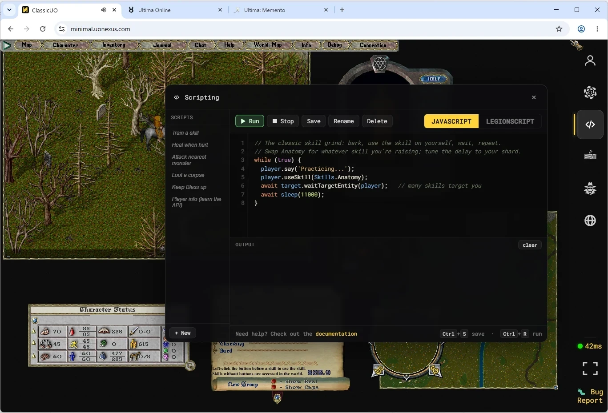
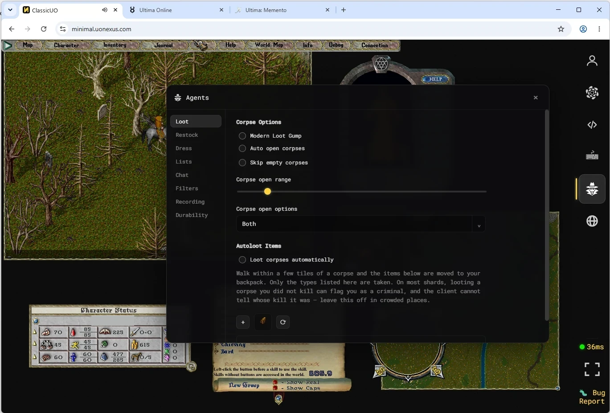
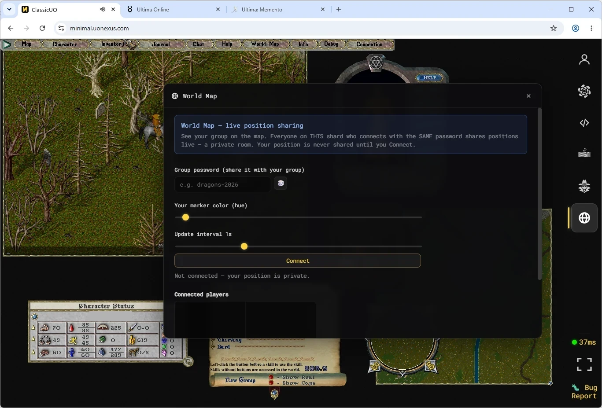

# UO Nexus - Ultima Online web client opensource

A real Ultima Online client — ClassicUO and TazUO, compiled to WebAssembly — that runs in a browser
against **your** shard, with a small Node proxy to relay the UO protocol over WebSockets.

Point it at your server, drop in your game files, `docker compose up`. Players get a URL.

⚠️ **Browser:** Chrome or Edge are the only tested and supported browsers. Other browsers, including Vivaldi, Opera, Brave, Yandex and Samsung Internet, are allowed with a one-time compatibility warning and may experience rendering, audio or stability issues.

⚠️ **Hardware:** The browser client is significantly heavier than the desktop client, using WebAssembly and WebGL 2 alongside the browser's overhead. Older hardware (especially ~15-year-old integrated GPUs) or laptops running in power-saving mode may struggle, particularly in busy areas.

> 📖 **Curious how this came about?** → **[Where this came from](#where-this-came-from)** — six
> months, one non-developer, and a fairly blunt account of what building it this way was like.



*A real Ultima Online client running in a browser tab. Paperdoll, backpack, skills, journal and
minimap are the client's own — the column down the right edge is this project's, and is the only
thing added.*

---

## See it running

Two public deployments, so you can try the client before deciding whether to host it.

| | |
|---|---|
| **[minimal.uonexus.com](https://minimal.uonexus.com)** | **This repository, deployed as it ships.** One shard, no server picker, straight to a Play button — sign in with Discord if you want your client settings to follow you between machines, or continue as a guest. This is what `docker compose up` gives you. |
| **[uonexus.com](https://uonexus.com)** | **The full project this one was carved out of — and *not* what this repository builds.** The same client wrapped in a community portal: a picker with several shards, Discord accounts and profiles, trading cards, a marketplace, achievements, leaderboards and minigames. |

The client is the same build in both. Everything that differs is *around* it, and this repository is
deliberately the version with none of it — see [What is deliberately missing](#what-is-deliberately-missing).

Both are live shards with real players on them, so treat them as somebody's game rather than a
sandbox.

---

## How it actually works

Ultima Online is a native Windows game from 1997. There is no rewrite here and no emulator: this is
the **real client, compiled to run in a browser**.

### The client — C# on WebAssembly

| | |
|---|---|
| **Language** | C#, targeting **.NET 10** |
| **Codebase** | Forks of [ClassicUO](https://github.com/ClassicUO/ClassicUO) and [TazUO](https://github.com/PlayTazUO/TazUO) — mature open-source UO clients, ~200k lines between them |
| **Graphics** | [FNA](https://fna-xna.github.io/) (an open reimplementation of Microsoft XNA) on top of **FNA3D**, which the browser build drives through **WebGL 2** |
| **Platform layer** | **SDL2** (`sdl2-compat`, SDL3 underneath) and **FAudio**, compiled to WebAssembly |
| **Compiler** | **Emscripten**, via Microsoft's `Microsoft.NET.Sdk.WebAssembly` |
| **Compilation mode** | **AOT** (`RunAOTCompilation`) — the C# is compiled ahead of time to WebAssembly rather than interpreted, which is what makes it playable |

The pieces are built and shipped by the SDK, but the browser's own limits are what shape the port,
and two of them decide almost everything else.

### Mercury, and why threads are the whole story

A UO client is a game loop: it must run its world simulation, decode network packets and draw a
frame, sixty times a second. Standard .NET on WebAssembly is **single-threaded** — the browser gives
a page one thread, and everything above would fight over it. That is playable in the sense that a
slideshow is playable.

**[Mercury](https://github.com/MercuryWorkshop) is a build of the .NET runtime for WebAssembly with
real multi-threading**, from the Mercury Workshop project. It provides a patched runtime pack, a
matching Emscripten SDK and prebuilt native libraries (the `SDL2.a` and `FAudio.a` in
`source/vendor/`), so `WasmEnableThreads` genuinely produces threads: .NET runs on a **worker**,
with rendering marshalled to the page. That is the difference between this being a demo and being
something you can play.

The cost is a browser rule you will meet in the setup below. Multi-threaded WebAssembly needs
`SharedArrayBuffer`, and browsers only grant it to a **cross-origin isolated** page — one that sends
`Cross-Origin-Opener-Policy` and `Cross-Origin-Embedder-Policy` headers on **every** resource. Miss
them on one file and the client does not start slowly; it does not start at all. That is why the
nginx configuration repeats those two headers in every block, and why it looks repetitive.

### Where two gigabytes of game files go

A UO installation is a couple of gigabytes of `.mul` / `.uop` art, maps and sound. Downloading that
per visit is not an option, and it does not fit in the storage a page normally gets.

It is stored in the browser's **OPFS** (Origin Private File System) — a real filesystem for a web
page, which the .NET runtime mounts so the C# code opens the files by path exactly as the desktop
client does. The first visit downloads and stores; later visits read locally. Shortly after boot the
client re-hashes its copy against a **SHA-256 map** the install publishes and silently re-downloads
anything that no longer matches, so a file that rots in storage repairs itself instead of appearing
as artwork that is wrong for one thing and right everywhere else.

### The server side

The browser cannot open a TCP socket, and UO is a TCP protocol. So there is a relay.

| | |
|---|---|
| **Runtime** | **Node.js 22+**, TypeScript executed through `tsx` |
| **HTTP** | **Express** |
| **Relay** | **`ws`** — a WebSocket per player, bridged to a TCP socket to your shard, passing UO packets through in both directions |
| **Storage** | **SQLite**, through Node's own built-in `node:sqlite` (hence the `--experimental-sqlite` flag) |
| **Static serving** | **nginx** — the game files, the client bundle, brotli, and the `auth_request` gate in front of `/admin` |
| **Sign-in** | Discord OAuth2, sessions as **JWT** in an HTTP-only cookie. Entirely optional |
| **Packaging** | Docker Compose: nginx, the relay, and a worker that prepares game files |

The relay is deliberately thin. It does not understand the game: it does not parse your packets,
know your character or hold your world state. Your shard remains the authority on everything, which
is why this works against ModernUO, ServUO, RunUO and Sphere without any of them knowing it exists.

### What this repository is

A **snapshot** published from a larger private monorepo, carrying the client source and the reduced
backend and nothing else. The published file list is derived from the **import graph of the
entrypoint**, not from a hand-kept list — so the portal, economy and minigame code that the hosted
deployment runs cannot arrive here by somebody forgetting to exclude it.

---

## Before you start

You need four things. The first two are the ones people underestimate, and the last is about your
players rather than your server.

| | |
|---|---|
| **A UO shard** | ModernUO, ServUO, RunUO, Sphere — anything speaking the UO protocol. It does not have to be on this machine, but this stack must be able to reach its host and port. |
| **Your own game files** | The `.mul` / `.uop` set your shard expects. **We ship none** — they are Electronic Arts' files, not ours to distribute. Copy them from a UO installation whose client version matches your shard. |
| **Docker** with compose | Everything runs in containers. |
| **Chrome or Edge**, for whoever plays | The two supported browsers — other Chromium forks included in "other". This is about your PLAYERS, not the machine you host on: the server does not care what you run it on. |

Optionally, a **Discord application** if you want players to sign in and have their client settings
(macros, hotkeys, gump layout) follow them between machines. Without one the client is fully
playable as a guest — the Discord routes simply answer 503 and nothing else changes.

### Two ways to get the client

**Download a release, and skip the build.** Every version is published with a zip that carries this
whole tree **plus both clients already compiled**. Nothing else to install:

Grab the zip from the [latest release](https://github.com/rootmancer/uonexus-minimal/releases/latest),
then:

```bash
unzip uonexus-minimal-*.zip && cd uonexus-minimal-*/
```

**Or clone and build it yourself.** The repository ships source, not bundles, so this adds a
toolchain: **.NET SDK 10** with the WebAssembly workload
(`dotnet workload install wasm-tools`). The first build takes a while — it is a full AOT
WebAssembly compile — and you only repeat it when you change the client.

Either way, the rest of the setup is identical. The steps below say which ones a release download
can skip.

---

## How the folders fit together

Everything hangs off your clone. Three directories are yours to fill; the rest comes with the repo.

```
uonexus-minimal/
├── .env                     ← YOU CREATE THIS (from env.minimal.example)
├── docker-compose.minimal.yml
├── servers/
│   ├── minimal.yaml.example
│   └── myshard.yaml         ← YOU CREATE THIS (one file = one shard)
├── gamefiles/               ← YOU FILL THIS
│   └── myshard/             ← named after SHARD_SLUG in .env
│       ├── art.mul
│       ├── tiledata.mul
│       └── … the rest of your .mul / .uop set
├── client/                  ← NOT IN THE REPO: you build it, or it comes in a release zip
│   ├── minimal/             ← ClassicUO, served at /
│   │   └── config.json      ← YOU EDIT THIS (copied from config.example.json)
│   └── minimal-tuo/         ← TazUO, served at /tuo/   (optional)
├── data/                    ← created on first run: accounts, settings, profiles
├── webidentity/             ← handlers to install on YOUR shard (optional, see below)
├── source/                  ← the client source you compile
└── server/                  ← the proxy and its scripts
```

**Four names have to be the same word, and getting one wrong is the most common mistake here.**
They are in four different files, which is exactly why:

| Where | What it is | If it does not match |
|---|---|---|
| `SHARD_SLUG` in `.env` | Picks which folder of game files the containers mount. | The mount points at nothing, every asset 404s, and the client **loads for ever** with no error. |
| `slug:` in `servers/<name>.yaml` | What the relay calls your shard. | See below — this is the one the client asks for. |
| the folder under `gamefiles/` | Where your `.mul` / `.uop` files actually are. | Same as `SHARD_SLUG`: an empty mount and an endless loading screen. |
| `slug` in `client/minimal/config.json` | What the **browser** asks the relay to connect it to. | The relay cannot resolve the shard, so the game never connects — the client loads fine and then simply does not get in. |

None of these fail with a message naming the mismatch, which is why they are worth checking first.
Pick one word — lowercase letters, digits and hyphens — and use it in all four.

⚠️ **The fourth one is easy to miss** because it lives in the built client rather than in your
configuration — and because the file is already there when you first look. The release zip ships
**both** `config.example.json` and a ready-made `config.json`, and that `config.json` is filled in
with placeholders: `slug` reads `myshard` and `clientVersion` reads `7.0.45.1`. Nothing about it
looks unfinished, so it is easy to assume your install created it and it is already yours.

Until you edit it, the client loads perfectly and then retries the connection every thirty seconds,
showing **"Reconnect, please wait… Socket Error"**. That message names neither the slug nor the
file, and the retry can never succeed: the client reads `config.json` once at startup, so it keeps
asking for a shard that does not exist until the page is reloaded.

⚠️ **Upgrading can silently undo your edit.** Rebuilding the bundle with
`build-minimal-bundle.mjs` keeps an existing `config.json` on purpose, but copying a newer release
tree over an install by hand — `cp -r`, robocopy, an rsync without exclusions — overwrites it with
the placeholder again and puts you straight back at the Socket Error above, on an install that was
working a minute earlier. **Exclude `config.json` whenever you copy a release over an existing
install.**

---

## The three containers, and what each is for

`docker compose up` starts three. Only one of them has a port on your machine.

### `nginx` — the only thing exposed

The front door, and the sole published port (`PORT`, default 8080). It serves two things **straight
off disk**, without the relay ever seeing the request: the client bundles, and your game files.
Anything under `/api/`, `/auth/`, `/ws` and `/uoam` it hands to the relay.

It is a **custom image**, not stock nginx, for one reason: `brotli_static`. Your game files are
hundreds of megabytes and are shipped pre-compressed; stock nginx cannot serve the `.br` twins, so
every player would download the raw set.

It also sends the two headers the client cannot start without — `Cross-Origin-Opener-Policy` and
`Cross-Origin-Embedder-Policy`. They are what unlock `SharedArrayBuffer`, and the client is
multi-threaded WebAssembly: without them it does not run slower, it does not boot. If you put your
own reverse proxy or CDN in front, **it must pass both through**.

Runs with a read-only filesystem and all Linux capabilities dropped but the four it needs.

### `proxy` — the relay and the API

The Node process. It holds one TCP connection to your shard per player and relays the UO protocol
over a WebSocket to their browser — that is the whole trick that makes a 1997 client work in a tab.
It also answers the API: sign-in, settings, profiles, the admin panel, and the shared world-map
positions on `/uoam`.

It owns `data/` — the SQLite database with accounts, saved settings and player profiles. **That
directory is the only state worth keeping**; everything else can be rebuilt.

**It is not exposed to your machine.** Only nginx can reach it, over the compose network.

It also mounts the two client bundles read-only, which looks odd for a backend. The reason is the
client selector: the admin panel can grey out a client that is not installed, but that is the
*browser* deciding, and a browser can be told to send the request anyway. The process that has to
**refuse** the setting needs to see for itself whether the bundle is there.

### `asset-worker` — prepares the game files

Runs in the background, every `WORKER_INTERVAL_SECS`, over your `gamefiles/` directory. Two jobs:
it writes the **hash manifest** the client checks its cached copy against — this is what makes a
corrupted download repair itself instead of producing invisible graphical glitches — and it makes
the **brotli twins** nginx serves.

It writes; the other two only read. Drop in a new `.mul` set and this is what notices.

⚠️ **It has no healthcheck on purpose.** It shares the relay's image, whose health probe asks an
HTTP endpoint — and a worker serves no HTTP, so it would sit permanently `unhealthy` while working
perfectly. A health signal that is wrong by construction is worse than none: it teaches you to
ignore the one that matters.

---

## Setting it up

**1. Configuration.**

```bash
cp env.minimal.example .env
```

Then edit `.env`. Only four values matter to begin with:

| Variable | What it is |
|---|---|
| `UO_HOST` / `UO_PORT` | Where your shard listens. Not defaulted on purpose: a default here would quietly expose the host's whole network as an SSRF target. |
| `SHARD_SLUG` | A short name, e.g. `myshard`. It names your gamefiles folder and your shard YAML's `slug`. |
| `JWT_SECRET` | **Generate a real one.** It signs session tokens; the shipped value is a placeholder, and leaving it means anyone who has read this file can mint a session on your install. |

```bash
node -e "console.log(require('crypto').randomBytes(32).toString('hex'))"
```

**2. Your shard.**

```bash
cp servers/minimal.yaml.example servers/myshard.yaml
```

Edit it. `id` must be a positive integer, `slug` must match `SHARD_SLUG`, and `clientVersion` must
be the version your shard expects — a mismatch is rejected at login with no legible client-side
error, so check this one twice. Leave `gamefilesPath` pointing at `/gamefiles-root/<your slug>`:
that is a path **inside the container**, which the compose file already mounts for you.

**3. Your game files.**

```bash
mkdir -p gamefiles/myshard
# copy your .mul / .uop set into it
```

**4. Build the client** — *skip this if you downloaded a release; `client/` is already there.*

```bash
CLIENT_NAME=cuo ./server/scripts/build.sh prod          # compiles ClassicUO to WebAssembly (slow)
node server/scripts/build-minimal-bundle.mjs cuo        # -> client/minimal
```

**5. Point the client at your shard.** Edit `client/minimal/config.json` (and
`client/minimal-tuo/config.json` if you serve TazUO) so its `slug` is your word, and set
`clientVersion` and `encrypt` to match your shard. This is the fourth name from the table above.

**6. Start it.**

```bash
docker compose -f docker-compose.minimal.yml up -d
```

Open `http://localhost:8080`.


*What a visitor sees. Discord sign-in appears only if you configured an application; without one,
"Continue as guest" is the whole gate.*

---

## Every setting in `.env`

Step 1 above lists the four you cannot skip. This is the rest, with the defaults the code actually
uses. Everything here is optional — the install runs with the four.

### Serving

| Variable | Default | What it does |
|---|---|---|
| `PORT` | `8080` | The port on **your machine**. Maps to nginx's port 80 inside the container. |
| `SERVER_NAME` | — | The name shown on the landing page. Cosmetic. |
| `PUBLIC_ORIGINS` | — | Comma-separated extra origins your install is reached at, e.g. `https://uo.example.com`. Unset is fine and is the usual case: the boot log says `origin checks accept same-origin only`, which is exactly right when the page and the API share a hostname. You need it only when they do not — a separate API subdomain, or an embed on another site. |
| `COOKIE_DOMAIN` | — | Set only if you serve the client and the API from different subdomains of one domain. Wrong values break sign-in without a message. |
| `TRUST_PROXY_HOPS` | `0` | How many reverse proxies sit in front. **Getting this wrong breaks rate limiting**, in whichever direction you err: too low and every player looks like one address, so one player's traffic throttles everyone; too high and each player can appear to be a fresh address by sending a header. Behind Cloudflare or one nginx, `1`. |

### Capacity and abuse

| Variable | Default | What it does |
|---|---|---|
| `UO_MAX_SESSIONS` | `1000` | Hard cap on simultaneous players. Beyond it, connections are refused rather than accepted and starved. |
| `PROXY_RATE_LIMIT_PER_MIN` | `10` | Sustained new connections per minute, per address. |
| `PROXY_RATE_LIMIT_BURST` | `30` | How much a single address may spike above that before being refused. |
| `PROXY_RATE_LIMIT_WHITELIST` | — | CIDRs exempt from both, e.g. `10.0.0.0/8,192.168.0.0/16`. Useful for a LAN or your own monitoring. |

### Discord sign-in — optional, and the full walkthrough

Without these the client is fully playable; the sign-in routes answer 503 and the landing shows only
"Continue as guest". With them, a player's macros, hotkeys and gump layout follow them between
machines, and you get an admin panel.

| Variable | What it does |
|---|---|
| `DISCORD_CLIENT_ID` / `DISCORD_CLIENT_SECRET` | From your own Discord application. |
| `DISCORD_REDIRECT_URI` | Must match the redirect registered in that application **exactly**. |
| `DISCORD_INVITE_URL` | Optional. The invite your landing page links to. Empty removes the icon. |
| `ADMIN_SUBS` | Comma-separated Discord user ids that may open `/admin`. **Nobody is an admin until you set this**, and the panel answers a bare 404 to everyone else — that is the gate working, not a broken deploy. |

#### Getting them from Discord

**1 — Create an application.** Go to the [Discord Developer Portal](https://discord.com/developers/applications)
and use **New Application**. The name and icon you give it are what players see on the consent screen,
so name it after your shard rather than after this project. You do **not** need a bot: this uses
OAuth2 sign-in only, and adding a bot user changes nothing here.

**2 — Copy the Client ID.** On the application's **OAuth2** page, under *Client information*. It is a
long number, it is not secret, and it goes in `DISCORD_CLIENT_ID`.

**3 — Reveal the Client Secret.** Same page, **Reset Secret**. Discord shows it **once** — copy it
straight into your `.env` as `DISCORD_CLIENT_SECRET`. If you lose it, reset again; the old one stops
working the moment you do, so do not reset it on a live install without being ready to redeploy.

> 🚨 This is a real credential. It belongs in `.env`, which is gitignored, and nowhere else — not in
> a compose file you commit, not in a screenshot, not in a support message.

**4 — Register the redirect.** On the same **OAuth2** page, under *Redirects*, add the URL players
come back to and **Save Changes**:

```
http://localhost:8080/auth/discord/callback     # trying it locally
https://uo.example.com/auth/discord/callback    # once you have a domain
```

Put the same string in `DISCORD_REDIRECT_URI`.

🚨 **Discord matches this string exactly, character for character.** `http` vs `https`, a port that
is present on one side and not the other, a trailing slash, `www.` — any difference and sign-in stops
at Discord with `invalid_redirect_uri`, before it ever reaches your server, so there is nothing in
your logs to find. If you serve on both a domain and localhost, register **both**.

**5 — Restart** so the container picks up the new `.env`:

```bash
docker compose -f docker-compose.minimal.yml up -d
```

⚠️ **The sign-in button appears as soon as the CLIENT ID is set — the secret is not part of that
check.** So an install with the id filled in and the secret missing shows players a button that
sends them to Discord and then fails on the way back. Set both, or neither.

#### What the login asks for

Only the **`identify`** scope: your Discord id, username and avatar. Not your email, not your server
list, not your messages. That is the whole grant, and it is what the consent screen will say.

#### Making yourself an admin

`ADMIN_SUBS` takes Discord **user ids**, not usernames. To find yours: in Discord, open
**User Settings → Advanced** and turn on **Developer Mode**, then right-click your own name anywhere
and choose **Copy User ID**. Paste it in, restart, and sign in.

Until you do, `/admin` answers **404 to everybody, including you** — which is deliberate, so the panel
does not advertise its own existence. The boot log tells you which state you are in: look for
`admins=` on startup.

### The asset worker

| Variable | Default | What it does |
|---|---|---|
| `WORKER_INTERVAL_SECS` | `120` | How often it re-checks the game files for changes. |
| `BROTLI_QUALITY` | `9` | Compression level for the twins. **11 is not worth it here**: it takes hours over a full file set to gain a few percent, and 9 is a fraction of that. |
| `CLIENT_EPOCH` | `1` | Bump to force every player's browser to re-fetch the client. Only needed if you replace a bundle in place. |

### Host and identity

| Variable | Default | What it does |
|---|---|---|
| `GAMEFILES_ROOT` | `./gamefiles` | Where your file sets live, if not beside the compose file. |
| `APP_UID` / `APP_GID` | `1000` | The user the containers run as. Set these to your own (`id -u`, `id -g`) if `data/` or `gamefiles/` end up owned by the wrong user. |

### Do not set these by hand

`DATA_PATH`, `CLIENT_PATH`, `CLIENT_ROOT`, `SERVERS_DIR`, `DATA_SERVERS_DIR`, `MANIFESTS_DIR`,
`APP_CONFIG_PATH`, `ASSETS_PATH`, `ASSETS_PORT` are **paths inside the containers**, and the compose
file already sets each one to match the volume it mounts. Overriding one in `.env` points the
process at a directory that is not mounted, which fails as an empty result rather than an error.

`DEV_MODE`, `DEV_ADMIN` and the two `DEV_MODE_*` escapes exist for developing this project. They
relax authentication. **Never set them on an install anyone else can reach.**

A few names the code still reads are inert in this build — leftovers from the shared modules this
one is carved out of. Setting them does nothing.

---

## Serving TazUO as well, or instead

A release zip carries **both**, so there is nothing to do. Building from source, the same two steps
with the other fork give you the second client at `/tuo/`:

```bash
CLIENT_NAME=tuo ./server/scripts/build.sh prod
node server/scripts/build-minimal-bundle.mjs tuo        # -> client/minimal-tuo
```

Both stay reachable by their own URL. Which one a bare visit to `/` lands on is a setting in the
admin panel; skip this and `/tuo/` simply answers 404.

**The second step is not a second WebAssembly build.** A minimal bundle is the fork's compiled WASM
plus the trimmed web layer — `client/minimal/_framework` is byte-for-byte `client/cuo/_framework`.
`build-minimal-bundle.mjs` copies the fork's build and re-derives the web layer on top, which takes
seconds. It also keeps your `config.json` if one is already there.

### Which one should you serve?

They are not the same, and which one is better depends on your shard.

**ClassicUO has had far more work put into it here.** It came first, and it is the build most of this
port was written against. The clearest difference is the **chunk snapshot cache**: once the client
has assembled a piece of the map, it keeps it and loads it back instead of rebuilding it from your
game files every time a player walks through again. That is worth up to **30 fps** and the
difference between smooth movement and visible stuttering — we know because turning it off with
`?snapshot=off` is how it was measured.

⚠️ **It also ships OFF, because it has an open defect.** A snapshot records what the client had built
when it took the picture, and if something was missing at that moment it stays missing for as long
as the snapshot lives — walls and other scenery not drawn at all, in one spot, every time you go
back, while the rest of the world looks perfect. Guards were added and it still happens, so as of
v1.0.50 you decide: the admin panel's *Chunk snapshot cache* card turns it on and you get the frames
and the risk, or you leave it off and get a correct picture at the slower speed. The whole story,
with a picture of what it looks like, is under
[Missing static art](#missing-static-art--classicuo-and-only-with-the-chunk-cache-switched-on).

> **If scenery ever goes missing, reload with `?snapshot=off`.** If it comes back, the cache is at
> fault, not your files. If it does not come back, go and look at your `.mul` set.

**TazUO has had less of that work, and that is about the port rather than the client.** It was added
later, it does **not** have the snapshot cache — that lives in ClassicUO and was left there on
purpose — and there is genuine performance work still to do on it. On the same shard, expect fewer
frames in busy areas than you get from ClassicUO.

**It is also the only one that has coped with heavily customised RunUO shards.** On servers like
**Ultima Memento** and **Ultima Adventures**, where the content has drifted a long way from stock UO,
TazUO holds up and ClassicUO does not. So if that is your shard, run TazUO and live with the frame
rate. If you are on a fairly ordinary ModernUO, ServUO or Sphere, ClassicUO will feel better today.

You can also just serve both and let players pick. It costs nothing — the release zip already has
them both.

**What is coming.** Giving TazUO the snapshot cache is on the list, and it is the one change that
would do the most for its frame rate: the ClassicUO numbers above are what that system is worth on
the same machine. It is not done yet, and it is not being hurried, because the failure above is
exactly what you get when a snapshot is saved from an incomplete chunk — that took several attempts
to pin down on ClassicUO, and moving the cache across without also moving the guards would buy
frames at the price of scenery that never comes back.

In the meantime you are getting a TazUO that works, not a stand-in. It plays, it is the right choice
on the shards named above, and it is slower than it is going to be.
---

## When something is wrong

**Read the boot log first.** `docker compose -f docker-compose.minimal.yml logs proxy` prints what
the install actually resolved, and every line below is answered there.

| What you see | What it means |
|---|---|
| Log says `shard=default` after you wrote your YAML | The file was **rejected**. The reason is printed just above, starting with `[ServerRegistry] SKIP`. |
| Endless loading screen, or a stalled progress bar | The game files are not where the install expects. Two causes, in order of likelihood: the folder under `gamefiles/` is not named `SHARD_SLUG`, so the container mounts an empty directory; or `gamefilesPath` in your YAML is not `/gamefiles-root/<slug>`. |
| **"Reconnect, please wait… Socket Error"**, retrying every 30 s | The `slug` in `client/minimal/config.json` is not the one in your shard YAML, so the relay cannot resolve which shard the browser is asking for. The fourth name — and if you have never edited that file it still reads `myshard`. Confirm it in the proxy log, which prints `reject upgrade — unknown server slug in URL '/ws?server=<what the client asked for>'`. Fix the file and **reload the page**: the client reads it only at startup, so the retry alone will never recover. |
| Login refused, no error on screen | `clientVersion` in your YAML does not match what the shard expects. It is rejected at the protocol level, so nothing readable reaches the player. |
| The world map never appears | The asset worker has not baked it yet — it renders one PNG per facet on its first pass. Give it a few minutes; nothing to configure. |
| `/admin` answers 404 even for you | An empty `ADMIN_SUBS` means nobody, including you. The boot log says `admins=none`. |
| A player says it will not start, or looks wrong | Ask which browser, before anything else. Chrome and Edge are the supported pair; the client warns everyone else on their first visit, so they have already been told. See [URL parameters](#url-parameters) for the switches that answer the rest. |

---

## What players get

The game itself, plus a side rail with: their profile and stored data, the native Game Options, the
world map (shared positions between players on your shard), macros and hotkeys, scripting — both
JavaScript and LegionScript — and the agents.

They also need a reasonably modern machine and Chrome or Edge — see the two notes at the top. Both
are worth repeating wherever you announce your shard, because a player whose browser or hardware
cannot cope will report it as your server being broken.

| | |
|---|---|
|  |  |
| **Macros** — recorded and bound to a key, stored per character. | **Scripting** — JavaScript and LegionScript, against the verbs your shard allows. |
|  |  |
| **Agents** — loot, restock, dress, friends and enemies, chat, sound filters, recording and durability. | **World map** — with the positions of other players on your shard. |
|  | |
| **Storage** — what the browser is holding, and the buttons to clear it. | |

Two agent tabs depend on which client you built. **Sound Filters** is a TazUO feature, so on a
ClassicUO build that tab says so rather than pretending; **Friends** likewise, while the Enemies
(ignore) list works on both. **Chat** reflects whatever your shard actually has enabled.

**Scripts and agents belong to one character on one shard.** A player signed in with Discord carries
them between browsers and machines, but not between characters: both stores are scoped to
`<shard>/<character>`, so two accounts on your shard, or one player's two characters, never see each
other's work. Game macros, hotkeys and window layout are separated the same way — that separation
lives inside the profile the client packs, per server, account and character.

A **Help & FAQ** tab sits on the left edge, pointing at
[this project's FAQ](https://uonexus.com/faq) — it covers the client itself: getting started, the
rail, macros, what to do when something will not load. To send your players somewhere else instead,
edit the one `href` on `#faq-toggle` in `source/webclient/minimal-www/index.html` and rebuild the
web layer.

Their browser keeps a copy of your game files so the second visit is fast. A little after boot the
client re-hashes that copy against a SHA-256 map the install publishes, and silently re-downloads
anything that no longer matches — so a file corrupted in storage repairs itself instead of showing
up as artwork that is wrong for one specific thing and right everywhere else. The map is produced by
the asset worker incrementally and served at `/api/servers/<slug>/hashes`. Nothing to configure;
before the worker's first pass the install answers an empty map and the client skips the audit,
which is the honest degradation rather than an error.

---

## Changing how much memory the client reserves

The client asks the browser for a **fixed 2 GiB** the moment it starts, and never grows. That is a
deliberate trade, not an oversight: growth under multi-threaded WebAssembly was a source of crashes,
so the heap is committed once and left alone.

**Raise it if** your fileset is unusually large and the client dies partway through loading with an
out-of-memory error. **Lower it if** your players are on machines that cannot spare 2 GiB — the cost
is that a big fileset may not fit, and the client will fail at load rather than run slowly.

⚠️ **It is committed at boot, not reserved lazily.** A player whose browser cannot hand over the
whole amount does not get a slower client; they get one that does not start. Raising this raises the
floor for everybody on your shard.

The value lives in one property per client, in bytes:

| Client | File | Property |
|---|---|---|
| ClassicUO | `source/webclient/classicuo-wasm/classicuo-wasm.csproj` | `<UoWasmMemBytes>` |
| TazUO | `source/webclient/tazuo-wasm/tazuo-wasm.csproj` | `<UoWasmMemBytes>` |

```xml
<!-- 2 GiB (the default) -->
<UoWasmMemBytes>2147483648</UoWasmMemBytes>
<!-- 3 GiB -->
<UoWasmMemBytes>3221225472</UoWasmMemBytes>
```

Roughly what it has to hold, measured: the game files in memory (~740 MiB for a full fileset), the
ahead-of-time compiled code (~100 MiB), staging buffers (~100 MiB) and the .NET heap (~200 MiB).

**Then rebuild — this is a WebAssembly change, so the web-only path will not do it:**

```bash
CLIENT_NAME=cuo ./server/scripts/build.sh prod          # slow: a full AOT compile
node server/scripts/build-minimal-bundle.mjs cuo
docker compose -f docker-compose.minimal.yml up -d --force-recreate
```

Repeat with `tuo` if you serve TazUO. Your `config.json` is preserved; players re-download nothing,
because the game files are theirs and unchanged.

ℹ️ **Above 2 GiB puts wasm32 into its 4 GB-address-space mode.** It builds and boots, and has been
smoke-tested — but if you raise it and see odd runtime failures, this one line is the first thing to
put back.

---

## URL parameters

Add these to the client's address (`https://your.site/?snapshot=off`). They are the only levers a
PLAYER has, and most of what you will ask one to do when diagnosing something. Nothing here is a
setting — they last for that page load and no longer.

| Parameter | What it does |
|---|---|
| `?snapshot=off` | Turns off the **chunk cache**, the client's copy of map areas it has already drawn. **The first thing to ask for when part of the world stops rendering**: if the artwork comes back, it is that cache and not your fileset — see [Missing static art](#missing-static-art--classicuo-and-only-with-the-chunk-cache-switched-on). Costs frames. (`?snapshot=0` and `?snapshot=none` are the same.) The cache is **off by default**, so this only changes anything on an install that turned it on in the admin panel. ⚠️ **ClassicUO only.** TazUO has no chunk cache, so on `/tuo/` this parameter changes nothing and missing scenery there has some other cause — see [Which one should you serve?](#which-one-should-you-serve). |
| `?snapshot=full` | The other direction: runs the chunk cache for this one load even though the install has it off. Use it to measure what the cache is worth on the machine in front of you before deciding to enable it for everyone. (`?snapshot=on` and `?snapshot=1` are the same.) |
| `?snapshot=mem` | Middle setting: the cache works, but only in memory — nothing is written to browser storage. Useful for telling "the cache is wrong" apart from "what was SAVED is wrong". |
| `?dev=1` | Turns the browser console back on. It is silenced by default, so without this a player's console shows almost nothing and a bug report has no log. `?dev=2` is louder still. ⚠️ Has no effect if you switched the developer console off in the admin panel — that gate wins on purpose. |
| `?showcompat=1` | Forces the browser-compatibility notice on a supported browser, so you can see what an unsupported one is shown. |
| `?showgpu=1` | Forces the software-renderer warning the same way. That notice normally appears only when the browser is drawing without a GPU, which is the difference between playable and a slideshow. |
| `?teleDiag=1` | Turns on a very noisy teleport dump (~300 lines per jump). For chasing map-loading problems; off for everyone by default. |
| `?nocache=1` | Skips the loader's self-recovery after a failed boot. Only useful if that recovery is itself the thing misbehaving — the client also sets it on itself while recovering. |

ℹ️ **The parameter survives the redirect.** An install serving TazUO at `/` sends visitors from `/`
to `/tuo/`, and that used to drop everything after the path — so a player told to use
`?snapshot=off` landed without it, saw no change, and reported the workaround as broken. Fixed in
v1.0.22; on an older build, go straight to `/tuo/?snapshot=off`.

---

## The admin panel

There is one, at **`/admin`**. It is not linked from anywhere — deliberately — and it answers
**404** to everyone who is not an admin, so a stranger is never told it exists. You reach it by
typing the URL.

To become an admin, put your Discord user id in `ADMIN_SUBS` and restart — the steps, including
how to find that id, are under [Making yourself an admin](#making-yourself-an-admin). The boot log
tells you whether it worked: `admins=1` rather than `admins=none — /admin is unreachable`.

⚠️ **Empty `ADMIN_SUBS` means nobody, including you.** That is the safe default, but it is also
indistinguishable from a broken install if you do not know to look: `/admin` 404s either way. The
boot line is the signal that separates them.


*The panel documents itself: every section says what it reports, whether it changes anything, and
what it deliberately does not touch.*

From the panel you can see what the install resolved, choose whether a bare visit to `/` lands on
ClassicUO or TazUO, decide whether ClassicUO runs its
[chunk snapshot cache](#missing-static-art--classicuo-and-only-with-the-chunk-cache-switched-on) — a large speed-up
that carries an open defect, so it ships off — turn the client's developer console back on
while debugging, watch disk usage
and live sessions, ban a Discord id or an address, set which scripting verbs are allowed, download a
backup of everything the panel can change, and erase a player's stored data.


*Scripting is a tick-box per verb, grouped by what it does. Ticked means allowed; everything starts
allowed and you switch off what you do not want.*

**It does not edit your `.env` or your shard YAML.** Those are files you own on the box, and a web
form writing them would need a browser-reachable process with write access to your filesystem.

---

## Updating

Releases are cut per version. To move to a newer one, replace the tree and keep your own files:

- **keep** your `.env`, `servers/*.yaml`, `gamefiles/` and `data/` — none of them are in a release
- **replace** `client/`, `server/` and the compose file
- `docker compose -f docker-compose.minimal.yml up -d --force-recreate`

⚠️ **Never overwrite `client/minimal/config.json` with the one from a release.** That file holds the
shard *you* configured. Releases ship `config.example.json` beside it for exactly this reason, and a
plain `cp -r` of the bundle is how it gets reverted to the placeholder.

Players do not re-download the game files. A client update does not touch them, and the cache audit
that runs after boot compares each cached file against the published hash map and fetches only what
no longer matches — so replacing a fileset costs your players exactly the files you replaced.

---

## Optional but strongly recommended: WebIdentity

**Without this, your shard sees every web player as one address** — the relay's. That is not a
cosmetic detail. Your server's per-IP defences (connection throttles, ping limits, audit logs) all
treat those players as the same person, so a single reconnect storm locks everyone out, and your
logs cannot tell two players apart.

WebIdentity fixes it. The relay prefixes each upstream connection with a small frame carrying that
player's real address plus a shared secret, and your shard reads it. It is the same packet
(`0xA4`) the official ClassicUO web client uses, byte for byte.

It needs **both halves**, which is why it ships off:

**1. On your shard.** Ready-made handlers are in [`webidentity/`](webidentity/), with install notes:

| Your server | What to use |
|---|---|
| ModernUO | [`webidentity/modernuo/WebIdentity.cs`](webidentity/modernuo/WebIdentity.cs) |
| RunUO / ServUO | [`webidentity/runuo/WebIdentity.cs`](webidentity/runuo/WebIdentity.cs) |
| Sphere (Source-X) | [`webidentity/sphere/`](webidentity/sphere/) — a patch plus manual instructions |
| Anything .NET | [`webidentity/dotnet/`](webidentity/dotnet/) |

[`webidentity/README.md`](webidentity/README.md) explains the packet and why it exists.

**2. In your shard YAML**, with the *same* secret, at least 16 characters:

```yaml
webIdentity:
  enabled: true
  secret: use-the-same-long-random-string-on-both-sides
```

⚠️ **Do the shard side first.** Turning it on here alone means your server receives 149 bytes it
does not understand at the start of every connection.

---

## Optional: pre-compress the game files

```bash
node server/scripts/precompress-gamefiles.mjs --in gamefiles/<slug> --out gamefiles/<slug> --quality 9
```

nginx then serves the `.br` twins instead of the raw files, which is a large bandwidth win on a
fileset that runs to a couple of gigabytes. **It is not required to boot** — the loader asks for each
file by name and `brotli_static` falls back to the raw file when no twin exists. Quality 11 takes
hours; 9 takes a fraction of that for a few percent more bytes. The asset worker also does this on
its own for anything you add later.

---

## What is deliberately missing

No portal, no trading cards, no marketplace, no cosmetics, no minigames, no leaderboards, no
achievements, no analytics. Those exist in the hosted deployment this was carved out of —
[uonexus.com](https://uonexus.com), which you can compare against
[minimal.uonexus.com](https://minimal.uonexus.com) running this repository — and none of
that code is here — the published file list is derived from the import graph of the entrypoint, so
it cannot arrive by accident.

---

## Known issues

Two client bugs are open at the time of writing. Both are in the client itself rather than in this
stack, and both are stated here rather than left for you to discover.

⚠️ **You should not meet the first one on a default install.** It only happens when ClassicUO's
chunk cache is switched **on**, and that cache ships **off** precisely because of it. If you never
touch the setting, this section is background reading.

### Missing static art — ClassicUO, and only with the chunk cache switched ON

**This needs the chunk cache turned ON.** With the shipped default — off — the client reads every
area from your game files each time and the defect cannot occur. What follows describes what you are
trading away if you turn it on, and how to recognise it if you do.

**Parts of the world stop rendering.** Walls, floors and other static art vanish from an area while
everything else draws normally, so you end up looking at furniture standing in mid-air and a house
you can see straight through:


*ClassicUO, seen from the street. Half the roof is missing, so the floorboards, chairs and lamps
inside are drawn in the open air. The fileset is fine: the same spot draws correctly with the cache
off, which is what identifies this rather than your `.mul` set.*

**Why it happens.** ClassicUO caches decoded map chunks in browser storage so that walking back
into an area does not mean reading the game files again. A chunk can be captured while part of its
contents has already been freed; that partial copy passes every later check, gets stored, and is
handed back on the next visit. From then on the area is missing whatever was already gone at the
moment of capture.

**Where it stands.** Two rounds of fixes closed four ways in — the last one, in v1.0.17, added a
guard that refuses a capture holding fewer statics than the read inserted, and bumped the cache
schema so existing copies are discarded. **It still happens.** So as of v1.0.50 the cache ships
**off by default**, and whether to run it is now yours to decide from the admin panel.

**The trade you are being offered.** The cache is a *large* win: an A/B on the same build measured
up to **30 more frames per second** with it on, plus visibly fewer stutters when crossing into new
areas. Turning it on buys that and accepts this defect. Turning it off — the default — costs those
frames and draws the world correctly every time. Neither answer is wrong; it depends on what your
players run.

Both switches exist:

- **Per install**, in the admin panel: *Chunk snapshot cache* → **Off** / **On**. Applies on each
  player's next page load.
- **Per player, for one load**, with [`?snapshot=off`](#url-parameters) — and `?snapshot=full` to
  force it on the other way. This is also the **diagnostic**: if the missing artwork comes back with
  `?snapshot=off`, it is this and not your fileset, and that report is useful.

⚠️ **None of this reaches a TazUO-only install.** The cache is ClassicUO's and was deliberately not
ported — see [Which one should you serve?](#which-one-should-you-serve). Missing scenery on `/tuo/`
is a different problem, the switch does nothing there, and `?snapshot=off` will not move it.

### The tab occasionally freezes while typing at the login screen

Rare, not reproduced in ~690 automated attempts across two harnesses, and still open. The client
keeps a black box that survives the freeze: after it happens, reopen the site and a notice appears
with a **Copy report** button. Sending that report is the only way this gets fixed — it cannot be
reproduced on demand.

---

## Where this came from

I want to explain a little bit about myself, and how all of this came about.

For the past six months, I have been building this project using what is — terrible for the
industry, apparently — vibe coding: a web client modelled after, and aiming to be as close as
possible to, the official ClassicUO Web.

The project was born out of frustration. In such a small community as Ultima Online, it feels a bit
crazy that we keep building closed, isolated projects instead of opening things up and building on
top of each other.

For some context, I am not a developer, although I do work professionally in IT. I am much more
focused on the infrastructure side of things than on software development. I had not really written
code since university, so, needless to say, AI has been a bit of a gateway for me — and, apparently,
a gateway to committing six months of my life to this madness.

I have put a lot of effort into making sure the code complies with data protection regulations, that
the security hardening is VERY solid, and that there are not more bugs than there absolutely have to
be. I have fixed as many bugs as I could find, and I have tried to make sure that the version
released to the public is as close to a final version as possible.

That said, do not get the wrong idea: this is still very much in beta. At this point, it is also
about getting some kind souls to actually use it, break it, and find the bugs I somehow managed to
miss.

And with that said: AI is terrible.

Vibe coding is basically a terrorist attack on a project like this.

AI has a lot of strengths, and some of them are genuinely useful: security audits, finding bugs,
getting you unstuck on very specific tasks, and so on. But trusting an algorithm with your entire
project is basically like flipping a coin and hoping for the best.

I would not wish these six months on my worst enemy.

With all that said, thank you to **@Tsai** for the support — literally the only support this project
itself has had — and for **Ultima Memento**, which is his: an open-source Ultima Online server you
can run and play offline.

And thank you to **@Mr.Batman** and the [**ModernUO**](https://github.com/modernuo/ModernUO) project,
for making sure we still have a modern version of Ultima Online to build any of this on top of.

I really hope someone can get some use out of this and make something worthwhile with it.

**Long live Ultima Online.**

---

## About this repository

🚨 **It is generated.** The code is published from a private monorepo as a snapshot, so a commit made
here is overwritten by the next publish. Open an issue, or open a pull request anyway — it is a
perfectly good way to show a change; it will be applied upstream and arrive here in the next publish,
then closed rather than merged. See [CONTRIBUTING.md](CONTRIBUTING.md).

## Licence

**[BSD 2-Clause](LICENSE.md).** The clients are forks of
[ClassicUO](https://github.com/ClassicUO/ClassicUO) and [TazUO](https://github.com/PlayTazUO/TazUO),
both published by andreakarasho under that same licence — a derived work is simplest and safest under
the licence it derives from, so the upstream copyright line is kept and a second one covers the parts
written for this project: the web layer, the relay, the admin panel and the build tooling.

The vendored libraries under `source/*/external` (FNA, FAudio, FNA3D, SDL2-CS, Theorafile, Myra,
FontStashSharp and others) each keep their own licence file beside their source, and those terms
govern rather than this one.

The ModernUO and RunUO/ServUO handlers under [`webidentity/`](webidentity/) are the reference
implementation from [ClassicUO/packets](https://github.com/ClassicUO/packets), redistributed under
its licence — [`webidentity/LICENSE.upstream.md`](webidentity/LICENSE.upstream.md). The Sphere patch
in that folder is ours.

**Game files are not included and are not ours to license.** They are Electronic Arts' — you supply
your own, from a copy of Ultima Online you already have.
